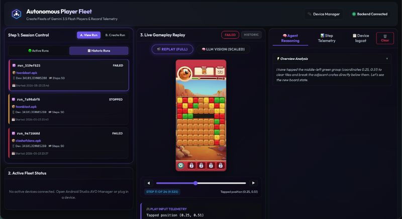
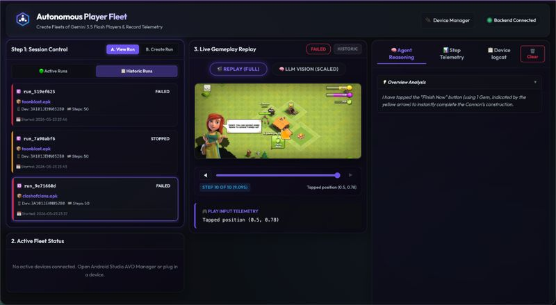
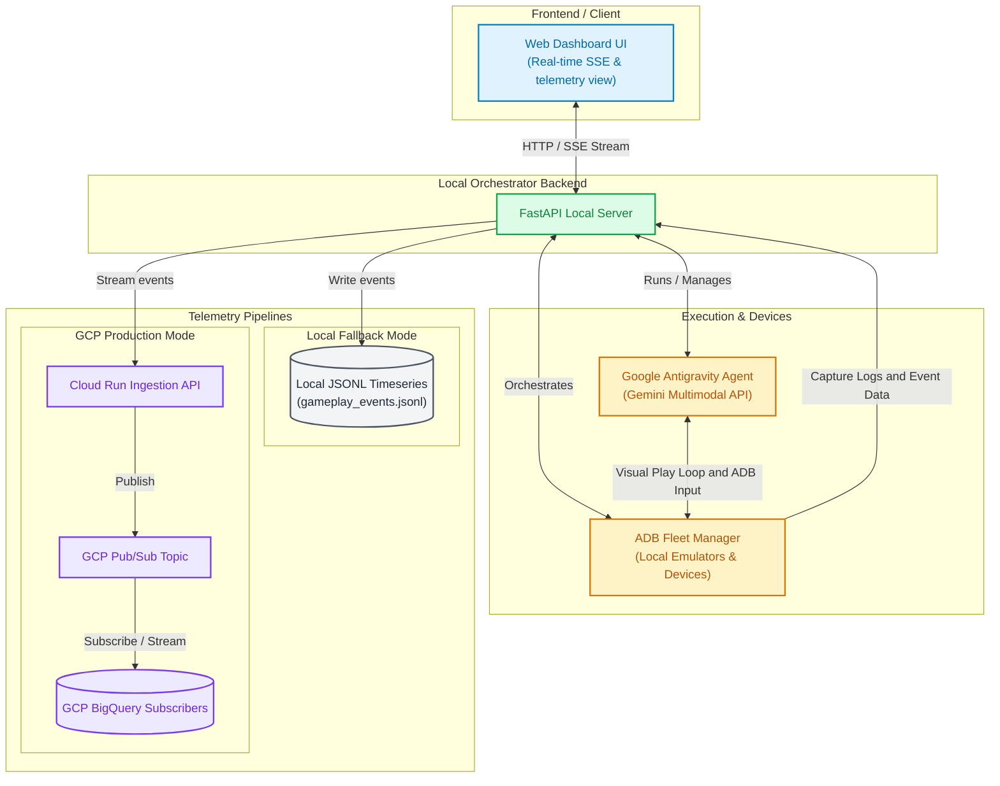

# 🚀 Autonomous Android Player Fleet & Telemetry Ingest
### 🏆 Top 6 Finalist at the Google I/O Hackathon (May 2026) 🏆
**Core Ingest Engine & Play-Simulations Console** — Featured in the [Google I/O Hackathon Gallery](https://cerebralvalley.ai/e/google-io-hackathon/hackathon/gallery)

*Selected as a **Top 6 Finalist** out of **150+ project submissions** at the live event hosted at **SHACK15** inside the historic **San Francisco Ferry Building**.*

> [!NOTE]
> **Hackathon Delivery Story**: This entire repository—from low-level zero-dependency ADB control layers to the premium glassmorphism web console, dual-resolution image pipeline, and the autonomous Google Antigravity visual play-loop—was designed, implemented, and fully optimized **entirely today (May 23, 2026)**.
> It represents an intensive, high-speed collaboration between a human developer and **Antigravity**, a state-of-the-art agentic coding assistant designed by Google DeepMind, demonstrating the frontier of AI-assisted engineering.


<p align="center">
  
  
</p>

<p align="center">
  <a href="https://youtu.be/11Hqb10Qtwc" target="_blank">
    <strong>🎥 Google I/O Hackathon 2026 Video Demo Walkthrough</strong>
  </a>
</p>

---

## 🎯 Purpose & Vision
Standard Android UI testing frameworks (such as Appium, Espresso, or UI Automator) rely entirely on parsing accessibility layout trees (`UIHierarchy`) to locate buttons, inputs, and text fields. However, **modern Unity 3D mobile games, custom engines, and canvas-rendered applications render as a single flat graphics canvas**. They expose zero layout nodes, rendering traditional testing tools completely blind.

Our **Autonomous Player Fleet & Telemetry Ingest** engine solves this canvas-blindness barrier by mimicking how humans play. It uses **eyes** (high-speed visual screenshot frame grabs), **reasoning** (autonomous agents powered by the **Google Antigravity SDK** and **Gemini 3.5 Flash**), and **hands** (normalized relative coordinate tapping/swiping translated dynamically to device-specific absolute pixels). 

The ultimate goal of this system is to generate **massive, high-fidelity multimodal timeseries gameplay records**. These sequential datasets (visual state changes, step-by-step inputs, reasoning traces, and concurrent system logs) serve as the foundation to train next-generation ML foundation models, specifically **Joint-Embedding Predictive Architecture (JEPA-2) models** capable of modeling complex human gameplay behaviors and agent actions.

---

## 🏗️ System Architecture

Our codebase is structured into four core decoupled layers:
1. **Frontend Client (Visual Console)**: A premium, single-page, glassmorphic dashboard built using modern semantic HTML5 and pure Vanilla CSS. It connects via **Server-Sent Events (SSE)** to stream gameplay replays, visual tap vector overlays, and live reasoning in real-time.
2. **Local Backend (FastAPI Orchestrator)**: An asynchronous FastAPI server that manages file ingestion (APK uploads), controls emulator lifecycles, maps and routes play sessions, and brokers real-time SSE streams.
3. **Execution & Devices Layer (ADB & Antigravity)**: Low-level control wrappers that interface with the `adb` CLI to check dimensions, manage device wakefulness, clear/dump logcat buffers, and drive active play loops. It boots up autonomous agents powered by the Google Antigravity SDK.
4. **Telemetry Ingestion Pipelines**: Dual-mode export pipelines that write timeseries event logs locally (currently holding a rich dataset of **over 640MB** in `data/gameplay_events.jsonl`!) or stream them directly into a production-grade **Google Cloud Pub/Sub + BigQuery** ingestion warehouse.



---

## 🌟 Key Features Implemented Today

To ensure maximum performance, fleet autonomy, and a stellar user experience, the following features were designed and implemented from scratch today:

### 1. 🎯 Visual Relative Grid Tapping
To operate independently of differing physical device and emulator configurations (resolutions, aspect ratios, densities), our agent bypasses hardcoded pixels. The Antigravity agent decides taps and swipes on a **normalized relative float coordinate scale `[0.0 to 1.0]`**.
Upon action execution, the `FleetManager` queries the active device's real boundary dimensions and dynamically maps relative coordinates to absolute screen pixels:
```python
def execute_tap(self, device_id: str, rel_x: float, rel_y: float) -> str:
    res = self.get_device_resolution(device_id)
    abs_x = int(rel_x * res["width"])
    abs_y = int(rel_y * res["height"])
    cmd = ["adb", "-s", device_id, "shell", "input", "tap", str(abs_x), str(abs_y)]
    self.run_cmd(cmd)
```

### 2. ⚡ Dual-Image Processing Pipeline
To optimize both visual quality and processing speed:
- **Timeline Replays**: The fleet manager captures full-fidelity screenshots (e.g. `step_X.png`) and saves them locally to enable high-resolution player playthrough reviews in the dashboard.
- **Gemini Vision Inputs**: The system processes screenshots through a concurrent optimization pipeline, resizing them down to **lightweight `384px` thumbnails** (e.g. `step_X_llm.png`). This maintains a minimal visual token payload for the **Gemini 3.5 Flash** API, dropping visual token consumption, cutting API costs, and unlocking blazing-fast turn latency under `ThinkingLevel.MINIMAL`!

### 3. 🔄 Dynamic Screen Orientation Auto-Adaptation
Connected emulators and physical devices can dynamically switch orientations depending on the targeted package. Our system handles this gracefully:
- **Dynamic Resolution Tracking**: The backend caches and monitors the dimensions of captured screenshots at every step. If the width exceeds the height, the system automatically detects a rotated landscape orientation.
- **Responsive Web Dashboard Layouts**: The frontend UI instantly adapts CSS styles and viewports to scale screenshot aspects seamlessly, ensuring horizontal games (like *Clash of Clans*) and vertical games (like *Royal Match*) are displayed in full scale with accurate, real-time tap coordinate overlay vectors!

### 4. 🚀 Latency-Bypassing Macro-Action Sequencing
Rather than forcing a costly model round-trip for every single tap or short transition wait, our agent leverages a custom **macro-action sequencing tool**. It can formulate and submit a serialized chain of actions in a single reasoning step:
```json
[
  {"type": "tap", "x": 0.5, "y": 0.8},
  {"type": "wait", "seconds": 2.0},
  {"type": "swipe", "x1": 0.9, "y1": 0.5, "x2": 0.1, "y2": 0.5},
  {"type": "tap", "x": 0.1, "y": 0.4}
]
```
The backend processes these macro chains back-to-back synchronously, cutting visual loop latencies by **up to 75%** on menu screens and loading gates!

### 5. 🛡️ Keep-Awake Fleet Management
No-touch autonomous testing can be halted if a device goes to sleep or gets locked. Our `FleetManager` implements zero-touch wakefulness at start-up via low-level ADB scripts:
- Dispatches `svc power stayon true` to keep devices awake indefinitely.
- Sends keyevent `224` (wakes up screen if asleep).
- Dispatches `wm dismiss-keyguard` to automatically unlock lockscreens and keyguards.

### 6. 🔍 Smart APK Ingest & Version Checks
To minimize startup overhead, our backend integrates a smart APK ingestion pipeline using `pyaxmlparser`:
- Parses the manifest package name, `versionName`, and `versionCode` directly from uploaded APKs.
- Queries the targeted emulator using `dumpsys package` to check for active installations.
- **Skipping Inefficiencies**: If the target package exists with identical version metadata, **it skips the costly `adb install` step entirely**, dropping startup latency from 30 seconds to under 2 seconds!

### 7. 🔌 Simulated Fallback Device Fleet (No SDK Required for Reviewers!)
> [!IMPORTANT]
> **Reviewer Convenience**: To ensure hackathon judges can immediately play with, audit, and evaluate our dashboard without needing an Android emulator configured or Android SDK command-line tools installed, **we built a complete local mock device simulator**!
> When the dashboard is loaded, you can toggle **"Enable Simulated Fallback Devices"** in the drawer. Reviewers can provision simulated emulators (e.g. Google Pixel 8 Pro, Samsung, Nexus), boot them, launch autonomous runs, watch real-time coordinate taps overlays, scrub through steps, and inspect compiled mock logcats with zero environment setup!

### 8. 🎮 Real-Time Timeline Scrubber & Toggle Viewports
The visual replay column features advanced playthrough controls:
- **Interactive Scrubber Slider**: Drag the slider to scrub through active or historic gameplay frames.
- **Quick Timeline Steps**: Single-click `◀` and `▶` buttons let you step through visual events frame-by-frame.
- **Viewport Toggles**: Instantly toggle between `🎬 REPLAY (FULL)` (high-resolution screenshots with real-time tap vectors overlay) and `🧠 LLM VISION (SCALED)` (scaled-down 384px frame to see exactly what visual information the Gemini model is receiving).

### 9. 📋 Live Logcat Ingest & Diagnostic Console
- **Startup Flush**: Clears the system log buffer (`adb logcat -c`) on session startup.
- **Background Log Streamer**: Streams logcat logs concurrently in background tasks during active gameplay.
- **Terminal Viewport**: A dedicated browser tab acts as a monospace console, displaying the complete device and Unity engine logs immediately upon session completion to locate game engine exceptions or crashes!

---

## 🛠️ Technology Stack

| Component | Technology | Rationale |
| :--- | :--- | :--- |
| **Agent AI Core** | **Google Antigravity SDK** | Harnesses model hooks, tool policies, and LLM orchestration. |
| **Multimodal Model** | **Gemini 3.5 Flash** | Delivers ultra-low latency, outstanding visual recognition, and robust structured tools usage. |
| **Local Server** | **FastAPI (Python 3.13+)** | Supports high-concurrency async operations, background tasks, and lightweight JSON routing. |
| **Real-time Pipeline** | **SSE (Server-Sent Events)** | Offers extremely light, unidirectional visual and log streams to the client browser. |
| **Dashboard UI** | **Vanilla CSS & Semantic HTML5** | Replaces heavy front-end node build steps (no React/Webpack compile overhead) with custom violet/cyberpunk glassmorphism aesthetics. |
| **Low-Level Controls** | **Android ADB CLI & Popen** | Interfaces with local device hardware with zero bloat or heavy wrappers. |
| **Data Pipelines** | **GCP Pub/Sub & Cloud Run** | Streams telemetry directly into **Google Cloud BigQuery** for high-volume timeseries ingestion. |

---

## 📂 Directory Layout

```bash
├── Makefile                        # Interactive workspace console and workflow automation
├── README.md                       # This hackathon reviewer guide
├── run.sh                          # Automated virtualenv setup and server launcher script
├── backend/
│   ├── app.py                      # FastAPI routes, file uploading, and SSE connection brokers
│   ├── fleet_manager.py            # Low-level ADB wrappers, resolution detectors, and mock emulators database
│   ├── agent_runner.py             # Visual play loops, coordinate mapping, and Antigravity integrations
│   ├── ingestion.py                # Telemetry writer (Local JSONL fallback + GCP Pub/Sub publisher)
│   ├── requirements.txt            # Python dependencies (fastapi, pyaxmlparser, pillow, etc.)
│   └── google_antigravity-*.whl    # Local Google Antigravity SDK wheel package
├── frontend/
│   ├── index.html                  # Responsive three-column visual console structure
│   ├── style.css                   # Custom neon cyberpunk/glassmorphic stylesheet
│   └── app.js                      # SSE listeners, coordinate mapping overlays, and timeline scrubber
├── data/
│   └── gameplay_events.jsonl       # Local timeseries database (rich visual dataset of 640MB+)
├── dev-milestones/
│   ├── implementation_plan.md      # Milestone blueprints and design structures
│   └── walkthrough.md              # Original development progress walkthroughs
├── builds/                         # Destination for ingested game APK files
└── runs/                           # Session telemetry archives (screenshots, logcats, summaries)
```

---

## ⚡ Getting Started & Developer Guide

### 📋 Prerequisites
- **Python 3.13+** installed locally.
- **Node.js** (optional).
- **Homebrew** (on macOS) for native Android Tools:
  ```bash
  brew install --cask android-platform-tools
  ```

---

### 1. Automated Fast-Start
Simply execute our automated shell script in the root directory:
```bash
./run.sh
```
This script handles the heavy lifting:
1. Creates a Python virtual environment (`.venv`).
2. Upgrades `pip` and installs all backend requirements.
3. Automatically installs the local **Google Antigravity SDK** wheel file (`backend/google_antigravity-*.whl`).
4. Launches the FastAPI Uvicorn developer server on **`http://localhost:8000`** with hot reloading enabled!

Open [http://localhost:8000](http://localhost:8000) in your browser to experience the beautiful glassmorphic console!

---

### 2. Interactive Make Console
We created a gorgeous, color-coded interactive `Makefile` to simplify all development workflows. Type `make` in your terminal to see the help menu:

```bash
$ make
```

```text
=====================================================================
⚡ Android Player Fleet & Telemetry Ingest - Workflow Console ⚡
=====================================================================
Usage: make <target>

Available Targets:
  clean           Clear temporary python builds, run artifacts, logs, and python bytecode caches
  distclean       Reset repository completely by purging virtual environment and telemetry database files
  format          Format all Python code files automatically according to pep8 styles
  help            Display this gorgeous interactive help menu
  lint            Analyze and lint Python code quality using Ruff or Flake8
  run             Launch the FastAPI local backend server with automatic live reload on port 8000
  setup           Set up Python virtual environment, install requirements, and resolve local SDK dependencies
  status          Run dynamic system diagnostics, verify ADB connections, and check GCP telemetry configs
  test            Execute modular import and path integration verification checks on backend controllers
=====================================================================
```

#### Run Diagnostics
Verify your environment, active Android emulators, and active GCP connections in one command:
```bash
make status
```

#### Run Code Formatting & Quality Audits
Keep the codebase clean:
```bash
make format
make lint
```

#### Run Integration Verification Tests
Verify FastAPI imports, Pydantic readiness, and local Antigravity module load dynamics instantly:
```bash
make test
```

---

### 3. Reviewer Quick-Test (No Android Device Required!)
To test the visual playthrough capabilities of our autonomous agent immediately:
1. Open [http://localhost:8000](http://localhost:8000).
2. Click **"Device Manager"** (top right button).
3. In the slide-out drawer, verify that **"Enable Simulated Fallback Devices"** is checked.
4. Click **"Refresh"** inside the drawer—you will see `emulator-5554-mock (online)` under your Virtual Device Fleet. Close the drawer.
5. In the left panel, choose the **"Create Run"** tab (Step 1B).
6. Drag and drop any dummy file named with `.apk` extension (e.g. create a blank file `dummy.apk`), or select it.
7. Set Target Android Device to `Simulated Pixel 6 Pro (mock)`.
8. Click **"Launch Autonomous Player"**!
9. Under **"Live Gameplay Replay"** (middle panel), watch the real-time gameplay simulation initialize. Taps and swipes will begin execution, and **dynamic tap coordinate indicator dots** will flash on screen corresponding to coordinates chosen by the agent!
10. Use the **Timeline Scrubber** to step through previous actions, browse between the `🧠 Agent Reasoning`, `📊 Step Telemetry`, and `📋 Device logcat` tabs in the right-hand panel, and hit **"Stop Run"** to cleanly close active operations.

---

### 4. Production GCP Ingestion Setup
To stream timeseries event logs directly to Google Cloud Run, Cloud Pub/Sub, and Cloud BigQuery in production, export these environment variables in your terminal shell before starting the server:

```bash
export GEMINI_API_KEY="your-gemini-api-key"
export GCP_PROJECT_ID="your-gcp-project-id"
export GCP_PUBSUB_TOPIC="your-pubsub-topic-name"
export GOOGLE_APPLICATION_CREDENTIALS="/path/to/your/service-account-key.json"
```

If these credentials are not present, the orchestrator defaults to **Local Fallback Mode**, appending telemetry sequences to `data/gameplay_events.jsonl` (and storing local screenshots under `runs/`).

#### Ingesting Local Telemetry for Data Science / ML Training
You can immediately load the telemetry data generated by our players into a Jupyter notebook for exploratory data analysis or ML preprocessing:
```python
import pandas as pd
import json

# Load the local telemetry timeseries events
df = pd.read_json('data/gameplay_events.jsonl', lines=True)

# Inspect player actions, screenshots, and reasoning sequences
print(df.head())
```

---

## 🏆 Key Architectural Achievements & Highlights

1. **Unity OpenGL Vision Navigation**: Solved the Unity black-box canvas problem using standard visual feedback combined with normalized float mappings, opening game-testing automation to any engine.
2. **Ultra-Low Latency visual Loops**: Combined lightweight `384px` thumbnail pipelines with Gemini Flash's `ThinkingLevel.MINIMAL` parameters to achieve super-responsive interactive action frames.
3. **Responsive Dual Viewports**: Built full-fidelity capture timeline scrubbers side-by-side with LLM scaled vision viewports, giving developers complete clarity on what the model sees.
4. **Resilient Fleet Recovery**: Integrated automatic `startup` routines to scan runs directories and safely repair/reset any playing runs crashed or orphaned due to process restarts.

*Thank you for reviewing our Google I/O Hackathon 2026 project!*
