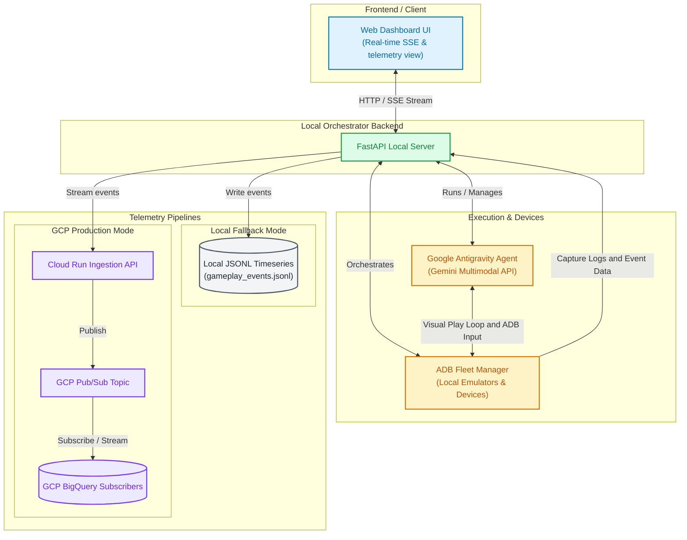

# Autonomous Android Simulator Player Fleet & Telemetry Ingest

A state-of-the-art simulated player fleet designed to play Unity 3D games and natives apps, gather gameplay telemetry, extract deep device logcats, and stream time-series events directly into Google Cloud BigQuery (via Cloud Run & Pub/Sub) or write to local files.

Built using the **Google Antigravity SDK**, **FastAPI**, and premium **Vanilla CSS Glassmorphism Web Dashboards**.

---

## Key Features

1. **Unity 3D Vision Play-Loop**:
   - Unity games render on a single native canvas and do not expose hierarchy text trees.
   - The agent takes screenshot frame grabs, feeds them to Gemini Vision inside the **Google Antigravity SDK**, and simulates human player inputs.
2. **Normalized Relative Coordinate Mapping**:
   - Taps, swipes, and visual actions use relative coordinates `[0.0 to 1.0]`.
   - The system automatically scales relative coordinates into device-specific pixels based on the emulator's resolution, ensuring fleet independence.
3. **Logcat Diagnostics collector**:
   - Clears logcats on session start (`adb logcat -c`).
   - Automatically dumps device logs (`adb logcat -d`) at the end of the play run, sending Unity Engine logs, debugger stacks, and crashes alongside player timeseries actions.
4. **Fast Macro-Action Sequencing**:
   - Reduces model round-trips by enabling play agents to submit chains of consecutive actions (e.g. `[tap coordinates, wait 2.0s, swipe left]`) in a single step.
5. **Real-time SSE Dashboard**:
   - Real-time Server-Sent Events (SSE) stream screenshots, reasoning steps, and ADB inputs to the web dashboard.
   - Interactive screen coordinates overlay overlays dynamic red "tap indicators" directly onto the screenshot!

---

## Architecture Diagram




---

## Getting Started

### Prerequisites

- **Python 3.13+** and **Node.js** installed locally.
- **Homebrew** installed (on MacOS).
- **Android Studio** and **Android Platform Tools (ADB)** installed:
  ```bash
  brew install --cask android-platform-tools
  ```

### Fast-Start Server Bootstrap

Simply run the automated bootstrap shell script in the root directory:
```bash
./run.sh
```

This will automatically:
1. Create a Python virtual environment (`.venv`).
2. Upgrade `pip` and install all server dependencies (`FastAPI`, `Uvicorn`, etc.).
3. Link and install the local **Google Antigravity SDK** wheel file (`google_antigravity-0.1.0-py3-none-macosx_11_0_arm64.whl`).
4. Perform path diagnostics to verify `adb` is connected.
5. Spin up the FastAPI local development server on **`http://localhost:8000`**!

Open [http://localhost:8000](http://localhost:8000) in your browser to view the gorgeous glassmorphic dashboard!

---

## Production GCP Telemetry Configurations

To enable direct exports to Google Cloud Pub/Sub and BigQuery, export the following environment variables before running the server:

```bash
export GCP_PROJECT_ID="your-gcp-project-id"
export GCP_PUBSUB_TOPIC="your-pubsub-topic-name"
export GOOGLE_APPLICATION_CREDENTIALS="/path/to/your/service-account-key.json"
```

If these environment variables are missing, the server operates in **Local Fallback Mode**, writing timeseries logs into `backend/data/gameplay_events.jsonl` which the dashboard reads and lists automatically.
