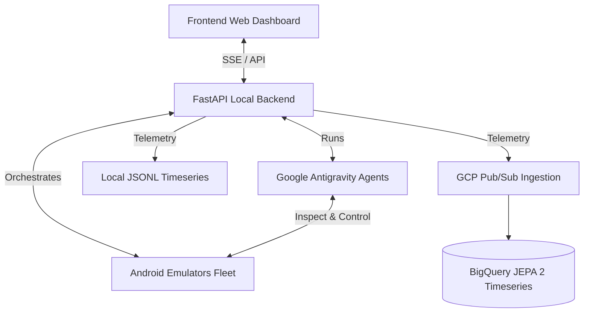

# Local Android Fleet for JEPA 2 ML Telemetry Ingestion (Updated with Device Logs)

This document details the implementation plan for creating an automated fleet of simulated Android players. The goal is to upload game builds (APKs), run them across a fleet of local Android emulators, have autonomous Google Antigravity AI agents play them at high speed based on user-provided instructions, and stream structured gameplay telemetry (actions, screenshots, layout dumps) to a GCP-aligned backend (or local mockup) for training a JEPA 2 timeseries ML model.

---

## User Review Required

> [!IMPORTANT]
> **Unity 3D Visual Play Loop (Relative Coordinates)**:
> Since Unity 3D games render inside a single OpenGL/Vulkan canvas (surface view), they do not expose individual buttons or game elements to the Android `layout` tree.
> Our Antigravity Agent will utilize a **Visual Play Loop**:
> 1. Capture the screen via `android screen capture`.
> 2. Pass the screenshot to the multimodal Gemini model inside the agent.
> 3. Use **normalized relative coordinates** `[0.0 to 1.0]` for inputs, allowing the agent to operate independently of the emulator's physical screen resolution.
> 4. Convert relative coordinates to pixels and execute inputs via `adb shell input tap/swipe`.

> [!TIP]
> **High-Speed Execution via Macro Actions**:
> To make play "as fast as possible", the agent will not be restricted to one action per frame. Instead of a simple `tap` command, the agent can formulate **macro action plans** (e.g., `"tap [0.5, 0.8] (Start Button)", "wait 2.0s", "tap [0.1, 0.4] (Select Level)"`) in a single reasoning step, execute them in sequence, and then capture the next frame. This minimizes LLM round-trip latency.

> [!IMPORTANT]
> **Device Logcat Collection (Telemetry)**:
> In addition to agent actions, we will capture native device logs (`logcat`) for the duration of the gameplay session:
> 1. **Session Start**: Clear the device's logcat buffer using `adb -s <device_id> logcat -c` to ensure a clean history.
> 2. **Session End**: Execute `adb -s <device_id> logcat -d` (dump) to retrieve all system and game engine logs generated during the run.
> 3. **Ingestion**: Send the complete log file to the ingestion backend (Cloud Run or local folder) in the final session summary payload to enrich the JEPA 2 timeseries data.

> [!IMPORTANT]
> **GCP Ingestion & Pub/Sub Setup**:
> This system is designed with a dual-mode telemetry exporter:
> 1. **GCP Production Mode**: Sends events to a Google Cloud Run service, which publishes them to Google Cloud Pub/Sub, which BigQuery subscribes to.
> 2. **Local Development Mode**: Falls back to local JSONL timeseries storage (`/scratch/gameplay_events.jsonl` in your workspace app data directory).
> To enable GCP Production Mode, you will need to set standard GCP credentials (`GOOGLE_APPLICATION_CREDENTIALS` or a valid authenticated active gcloud CLI profile).

> [!WARNING]
> **Android Emulator Support**:
> Running multiple local emulators requires significant RAM and CPU resources. We recommend starting with 1-2 emulators and scaling up. We will write commands to orchestrate AVDs (Android Virtual Devices) efficiently.

---

## Open Questions

> [!IMPORTANT]
> **What Android AVD (Android Virtual Device) image should we use by default?**
> If you have pre-created AVDs, our orchestrator can auto-detect and boot them. If not, our script can create lightweight AVDs (e.g. `system-images;android-30;google_apis;x86_64`) for you. Please let us know if you want us to handle AVD creation automatically or list your existing AVDs.

---

## Proposed Architecture

Our solution is divided into three layers:
1. **Frontend Dashboard**: A stunning, premium Vanilla CSS single-page dashboard. Includes:
   - Drag-and-drop APK uploader.
   - Emulator status monitors (grid of virtual devices, active screenshots, current agent actions).
   - Instructions builder (set target gameplay goals like "beat level 1", "click settings", etc.).
   - Live gameplay event telemetry log streams (with timing charts).
2. **FastAPI Backend (Local Orchestrator)**:
   - Orchestrates local emulators using `android emulator` and `adb`.
   - Boots up one Google Antigravity agent per running simulator.
   - Serves an SSE (Server-Sent Events) API to stream live logs, states, and event updates to the Frontend.
   - Contains an event ingestion pipeline that streams telemetry to GCP (Pub/Sub + BigQuery) or stores it locally.
3. **Google Antigravity Player Agent**:
   - An asynchronous Python agent that executes playing instructions.
   - Uses relative-coordinate vision processing.
   - Supports macro-action sequencing to speed up execution.

---

## Proposed Changes

We will build the following structure in your workspace:

### Backend Components

#### [NEW] [requirements.txt](file:///Users/bourkefloydiv/projects/google-io-hackathon-2026/backend/requirements.txt)
Specifies dependencies: `fastapi`, `uvicorn`, `pydantic`, `google-antigravity`, `google-cloud-pubsub`, `google-cloud-bigquery`, `jinja2`, `python-multipart`.

#### [NEW] [fleet_manager.py](file:///Users/bourkefloydiv/projects/google-io-hackathon-2026/backend/fleet_manager.py)
A module to detect, start, stop, and configure the local Android emulators using the `android emulator` CLI and `adb`. Manages clearing and dumping logcats.

#### [NEW] [agent_runner.py](file:///Users/bourkefloydiv/projects/google-io-hackathon-2026/backend/agent_runner.py)
Defines the `AndroidPlayerAgent` class using `google-antigravity` which runs the play-loop for an emulator, executing ADB commands and extracting telemetry events. Focuses on the screenshot-based relative coordinate vision tools.

#### [NEW] [ingestion.py](file:///Users/bourkefloydiv/projects/google-io-hackathon-2026/backend/ingestion.py)
Handles writing event timeseries to a local JSONL file, and exporting to Google Cloud Pub/Sub if configured.

#### [NEW] [app.py](file:///Users/bourkefloydiv/projects/google-io-hackathon-2026/backend/app.py)
FastAPI application that handles file uploads, controls the fleet, processes playing commands, and streams SSE logs.

---

### Frontend Components

#### [NEW] [index.html](file:///Users/bourkefloydiv/projects/google-io-hackathon-2026/frontend/index.html)
The structure for our visual dashboard (with modern typography and semantic HTML tags).

#### [NEW] [style.css](file:///Users/bourkefloydiv/projects/google-io-hackathon-2026/frontend/style.css)
A custom, highly premium Vanilla CSS styling sheet featuring dynamic glassmorphic panels, rich dark modes, animated gradients, and custom layout systems (no Tailwind).

#### [NEW] [app.js](file:///Users/bourkefloydiv/projects/google-io-hackathon-2026/frontend/app.js)
Frontend logic to upload APKs, handle SSE streams, render screenshots dynamically, and display gameplay actions.

---

### Helper Scripts & Orchestration

#### [NEW] [run.sh](file:///Users/bourkefloydiv/projects/google-io-hackathon-2026/run.sh)
An all-in-one script to install the `android` CLI if missing, build the Python virtual environment, install dependencies, and spin up both the FastAPI backend and dev server.

---

## Verification Plan

### Automated / Local Tests
1. **Tool Setup Verification**: Verify `android` and `adb` CLI tools run correctly.
2. **Backend Server API Tests**: Assert that endpoints (`/api/emulators`, `/api/upload`, `/api/play`, `/api/status`) respond.
3. **Mock Gameplay Simulation**: Run an agent workflow in a dry-run/mock mode to verify that events are generated and formatted correctly into the JSONL/PubSub formats.

### Manual Verification
1. Boot the FastAPI backend and open the premium web dashboard.
2. Drag and drop a test APK and type in instructions.
3. Observe the orchestrator start local emulators, deploy the APK, and see the agent play the game, streaming real-time screenshots and actions to the UI.
4. Verify that `/scratch/gameplay_events.jsonl` compiles all player action timelines accurately.
